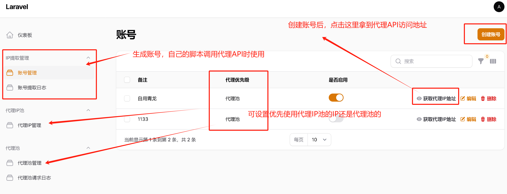
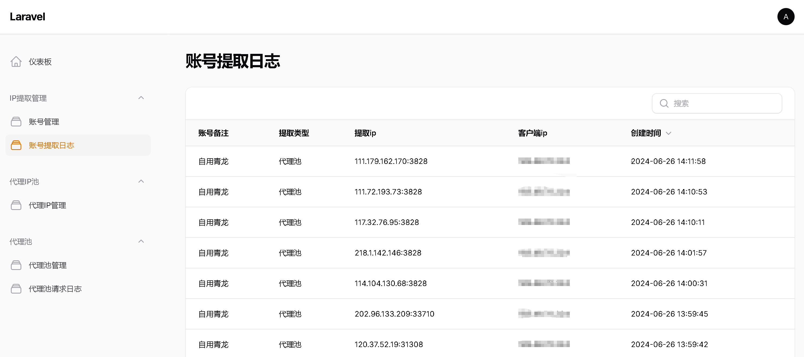
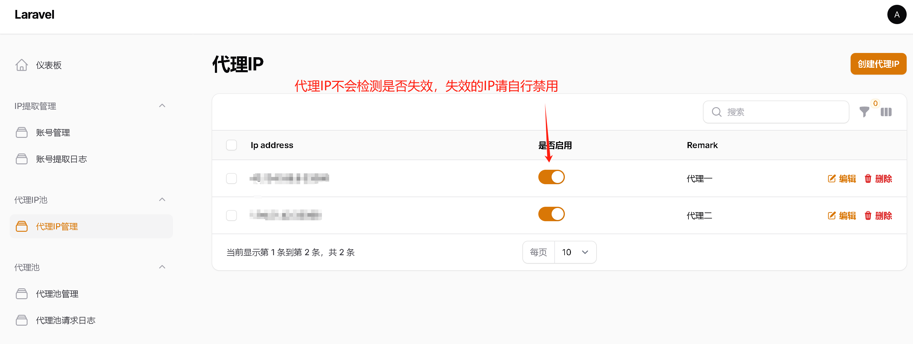
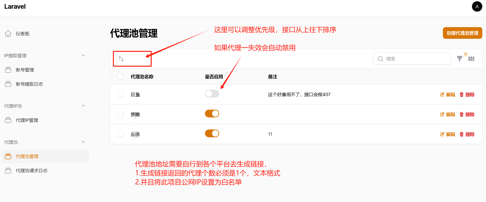

# IP代理中转平台

### 使用场景一：自身有多个代理ip，想每次调度随机分配给客户端使用
### 使用场景二：自己在多个代理平台领取免费代理，想实现A平台额度用完，自动切换使用B平台的额度。

## 配置指南

```bash
# 安装包管理
composer update --no-dev
# 创建软连接
php artisan storage:link
# 创建配置文件并配置好数据库以及APP_URL
cp .\.env.example .env
# 生成APP_KEY
php artisan key:generate
# 执行迁移
php artisan migrate
# 生成超级管理员账号
php artisan make:filament-user


# 代码每次更新，需要执行如下代码加速项目
sudo -u www composer update --no-dev
sudo -u www php artisan optimize
sudo -u www php artisan icons:cache
sudo -u www php artisan filament:clear-cached-components
sudo -u www php artisan config:clear
```






